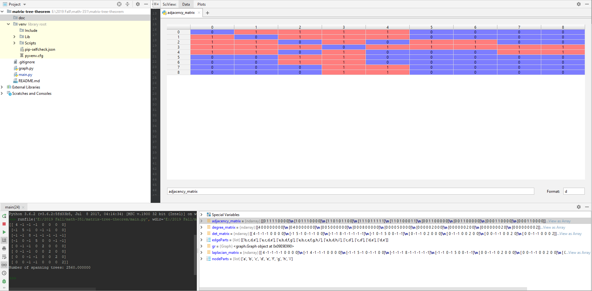

#matrix-tree-theorem

Implementation of the matrix tree theorem from graph theory.
Used to calculate the number of spanning tree from an existing graph.

## Usage
Uncomment for user input. Otherwise manually enter the nodes and edges of the graph.

Use the following notation:
```
nodes - "a, b, c, d, e, f, g, h"
edges - "[b, c, d, e], [a, c, d, e], [a, b, d, f, g], ..."
```
All nodes must have a corresponding list of edges.

## Example
```
nodes - "a, b, c, d, e, f, g, h, i"
edges - "[b, c, d, e], [a, c, d, e], [a, b, d, f, g], [a, b, c, e, f, g, h, i], 
         [a, b, d, h, i], [c, d], [c, d], [d, e], [d, e]"
         
> Number of spanning trees: 2560.000000
```

